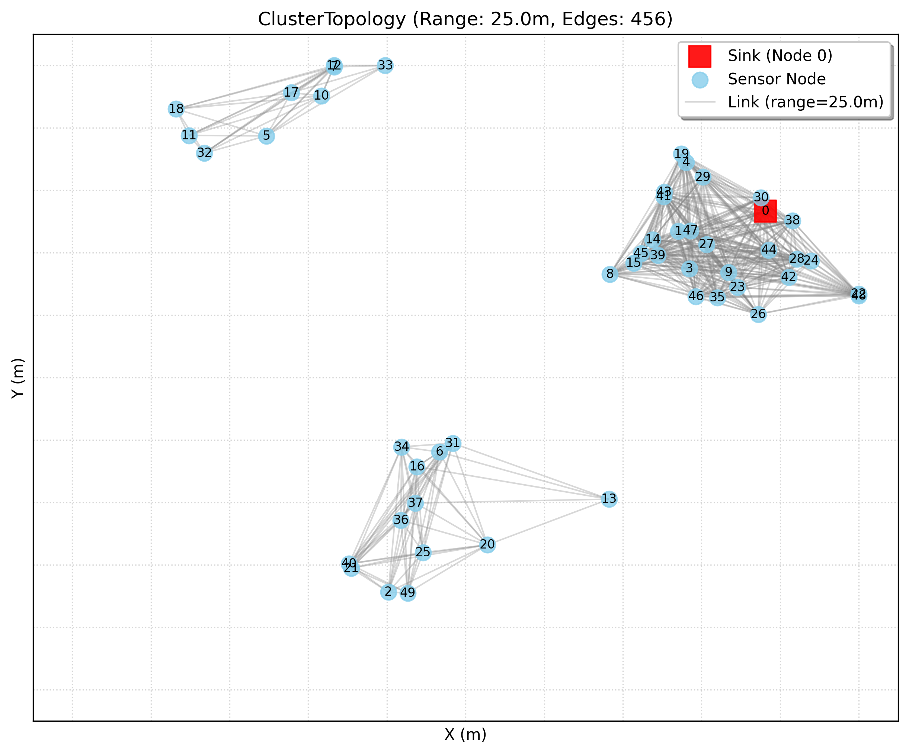
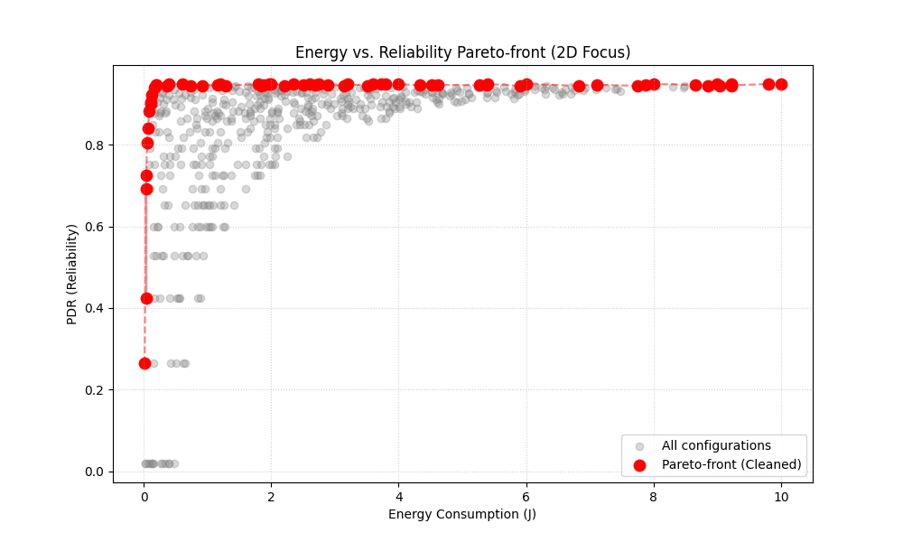
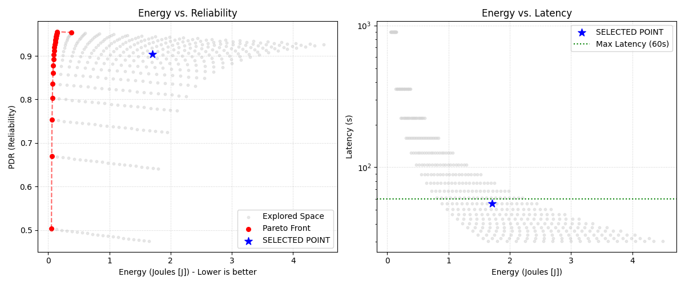

# wsnsim: Final Project Presentation

## 1. Problem: Forest Fire Detection in Extreme Conditions
*   **Challenge:** A forest-deployed WSN must simultaneously be **reliable** (saves lives), **fast** (timely alerts), and **long-lived** (hard-to-replace batteries).
*   **Conflict:** Increasing transmit power improves reliability but drains the battery faster. Reducing the data transmission frequency (Lower Duty Cycle) increases lifetime but slows down the alert response.
*   **Goal:** Find the mathematical "sweet spot" where the system meets safety requirements with the minimum possible energy consumption.

## 2. Model: The wsnsim Architecture
*   **DES Kernel:** Deterministic, event-driven simulation (heapq-based), ensuring bit-perfect reproducibility.
*   **Radio Channel:** Log-distance path loss and shadowing modeling to simulate environmental obstacles (foliage).
    *   *Proof:* See `reports/figures/prr.png` for the distance-based reception ratio validation.
*   **Energy Model:** Physics-based consumption tracking (Joules [J]), where:
    $$E = (P_{tx} \times 0.5 + 5.0) \times DC$$
*   **Edge AI:** EWMA and Z-Score based anomaly detection to filter redundant data traffic.
    *   *Proof:* See `reports/figures/edge_ai_tradeoff.png` for F1-score vs. Data Saving analysis.

## 3. Experiments: Design Space Exploration (DSE)
*   **Methodology:** 4,000 simulation runs (400 configurations $\times$ 10 repetitions).
*   **Topology Diversity:** Validated across Random, Grid, and Cluster deployments.
    
    *(Example: Cluster-based deployment for hotspot monitoring)*

## 4. Results: The Pareto Front
*   **Visualization:** The experiments revealed the **Energy vs. Reliability Pareto front**. This curve represents the boundary where one objective (e.g., PDR) cannot be improved without degrading another (e.g., Energy).
    

## 5. Decision: The Optimal Design Point
Based on safety constraints (PDR > 90%, Latency < 60s), the system selected the most energy-efficient point:
*   **TX Power:** 11.00 mW (+10.4 dBm)
*   **Duty Cycle:** 16.3%
*   **Outcome:** 90.5% reliability, 55.5s response time, 1.71 J/hour consumption.
    

## 6. Lessons Learned
*   **Determinism:** Seed-based randomness management was crucial for producing valid and reproducible research results.
*   **Physical Fidelity:** The ratio of protocol header (12 bytes) to payload (4 bytes) fundamentally determines the actual utility of Edge AI algorithms.
*   **Multi-objective Mindset:** A WSN system cannot be optimized for a single metric; Pareto optimality is essential for responsible engineering decision-making.
