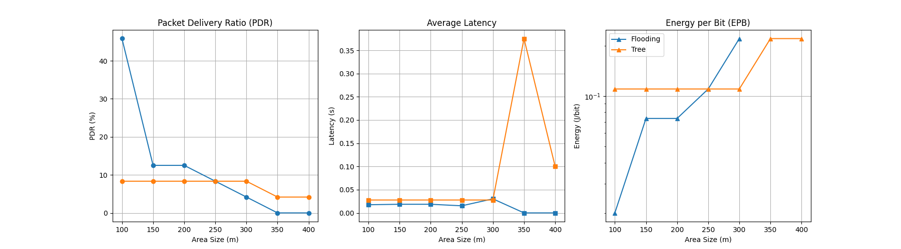
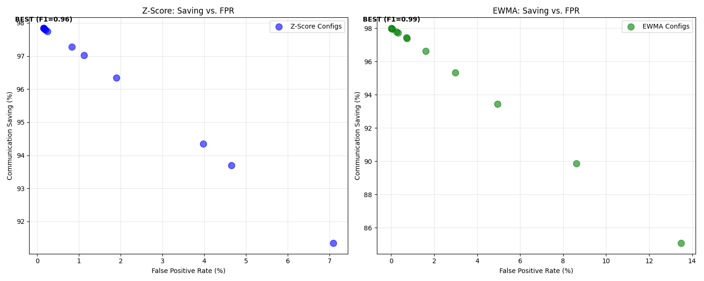
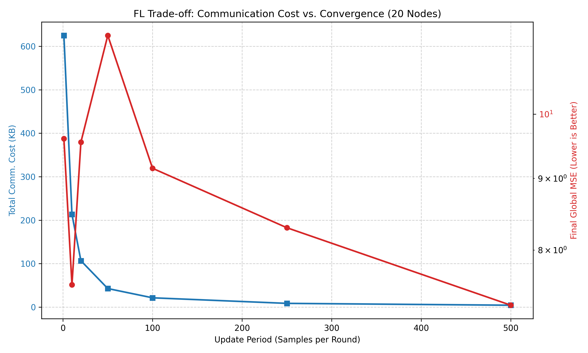
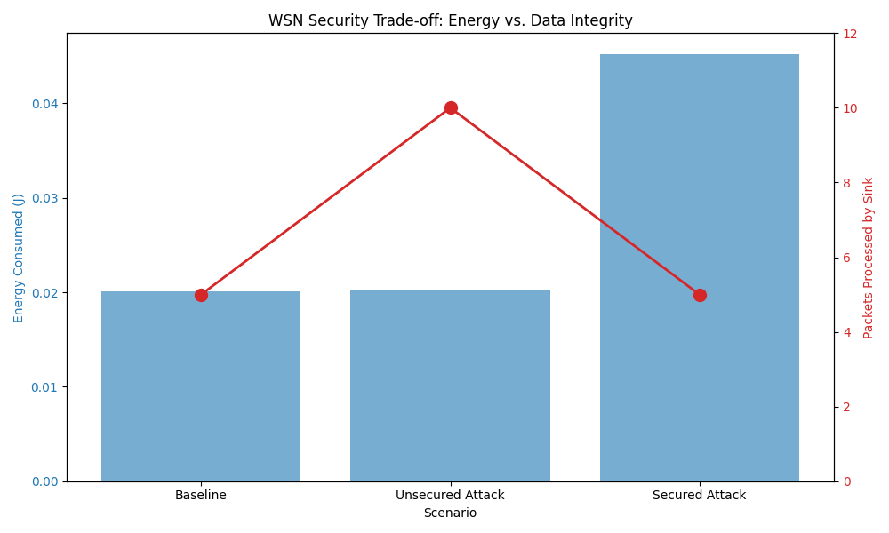
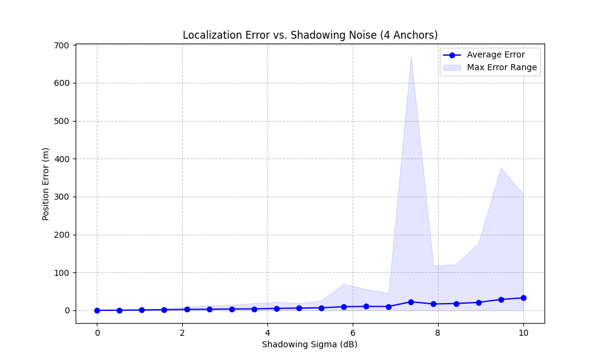

# wsnsim - Wireless Sensor Network Simulator

## Quick Start
```bash
# Setup environment
python3 -m venv .venv
source .venv/bin/activate
pip install -r requirements.txt

# Run the full evaluation suite (Tests -> Module Experiments -> Case Study)
chmod +x run_evaluation.sh
./run_evaluation.sh
```

## Results & Visualization
The evaluation process generates data and plots in the following locations:
- **Plots & Figures:** `reports/figures/presentation/` (e.g., Pareto fronts, trade-off curves).
- **Raw Data:** `reports/` (CSV files for sweeps and aggregated results).
- **Analysis Reports:** `reports/*.md` (Detailed summaries for Edge AI, Aggregation, and Case Studies).
- **Configuration:** `reports/optimization_config.json` (Traceability for simulation parameters).

### Visual Evidence & Module Verification
| Domain | Metric / Trade-off | Visualization |
| :--- | :--- | :--- |
| **Optimization** | Pareto Front (Energy vs Reliability) |  |
| **Routing** | Strategy Comparison (PDR vs Distance) |  |
| **Edge AI** | Detection Accuracy vs Data Savings |  |
| **Federated Learning** | Update Period vs Energy/Convergence |  |
| **Security** | Reliability under Replay Attack |  |
| **Spatio-temporal** | Localization Error vs Signal Noise |  |

## What are we simulating?
- **Scenario:** Forest Fire Detection. A dense network of sensors monitoring temperature and gas spikes in a high-shadowing environment (foliage).
- **Network:** Cluster-based topology with multi-hop tree routing to a central Sink.
- **Goal:** Multi-objective optimization to find the best balance between battery life and safety.
- **Metrics:** 
    - **PDR (Packet Reception Ratio):** Reliability of alert delivery.
    - **Latency:** Time-to-report for critical fire events.
    - **Energy (J):** Total consumption per operational hour.
    - **Lifetime:** Estimated node longevity based on Li-SOCl2 battery models.

## Modules
- `wsnsim/sim.py`: DES engine (Stable heapq-based event scheduler).
- `wsnsim/channel.py`: Radio model (Log-distance Path Loss + Shadowing + PRR).
- `wsnsim/energy.py`: Energy state machine (TX/RX/Idle/Sleep tracking).
- `wsnsim/mac.py`: MAC layer (CSMA/CA with exponential backoff).
- `wsnsim/routing.py`: Network layer (Flooding and Hierarchical Tree).
- `wsnsim/topology.py`: Deployment logic (Node placement and connectivity graphs).
- `wsnsim/edge_ai.py`: Intelligence (On-node Z-Score/EWMA anomaly detection).
- `wsnsim/aggregation.py`: Data fusion (Weighted averaging and multi-hop aggregation).
- `wsnsim/federated.py`: Federated Learning (Collaborative model training over WSN).
- `wsnsim/security.py`: Security overhead (Energy and latency modeling for crypto).
- `wsnsim/sync_localization.py`: Spatio-temporal services (Clock drift and node localization).
- `wsnsim/optimization.py`: DSE Engine (Pareto front identification & Sensitivity analysis).
- `wsnsim/common.py`: Shared primitives (Packet structures, Position, and geometry).

## Reproducibility
- **Seed Handling:** Every component accepts a `numpy.random.Generator` instance. All experiments use fixed seed sequences.
- **Config Dump:** Simulation parameters are automatically exported to `reports/optimization_config.json`.
- **Output Files:** Results are saved to `reports/` (CSV) and visualizations to `reports/figures/presentation/` (PNG).
